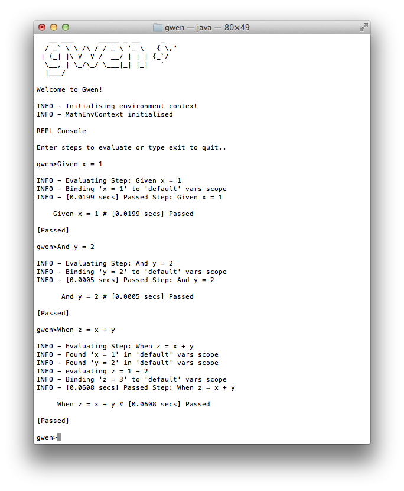
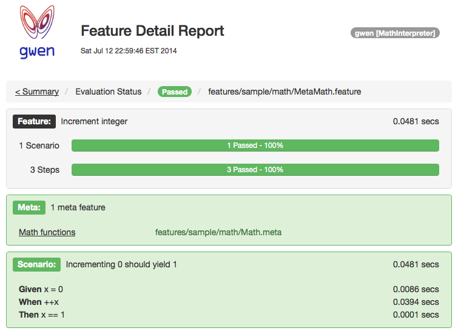

> A functional specifications interpreter that can evaluate any software 
> behavior expressed in plain Gherkin text. 

The Gwen Interpreter
--------------------

Gwen is a [Gherkin DSL](https://github.com/cucumber/cucumber/wiki/Gherkin) 
interpreter written in [Scala](http://www.scala-lang.org). It does not 
prescribe any set of steps and does not evaluate any one thing. That is up 
to you! It instead provides all the necessary processing and tooling required 
to interpret Gherkin features and abstracts the evaluation engine for you 
to prescribe what steps you want to support and define what thing you want to 
evaluate.

```    
   Feature: Gwen Interpreter
    
  Scenario: Evaluate a behavior
      Given a software system
        And a feature specification
       When Gwen is invoked
       Then interpretation will occur
	    And evaluation will result
```

### How does it work?

The Gwen interpreter reads Gherkin features and parses them into an abstract 
syntax tree for validation and correctness. It then traverses all scenarios 
and dispatches the processing of each step to an evaluation engine that you 
define (or provide) and mix in. Your engine performs the actual evaluation 
work required for each step. Gwen then captures and reports the results.

Core Features
-------------

- Gherkin feature parser
- Evaluation abstraction
- REPL console
- Evaluation reports
- Data scopes
- Meta features
- Composable steps
- Serial and parallel execution
- Tagged features and scenarios

Core Requirements
-----------------

- Java 1.6 or later
- Scala 2.11.x, 2.10.x 

Usage
-----

### Binary Dependency

To include Gwen as a binary dependency in your sbt project, add the following 
line to your build.sbt file. The `%%` instructs sbt to pull down the packaged 
dependency that matches your `scalaVersion` setting.  

```
libraryDependencies += "org.gweninterpreter" %% "gwen" % "0.1.0-SNAPSHOT"
```

If you are using maven, add the following dependency to your pom.xml file. You 
will need to explicitly specify the scala version as part of the `artifactId` 
suffix as shown.    

```
<dependency>
	<groupId>org.gweninterpreter</groupId>
	<artifactId>gwen_2.11</artifactId>       <!-- for scala 2.11.x -->
	<!--artifactId>gwen_2.10</artifactId-->  <!-- for scala 2.10.x -->
	<version>0.1.0-SNAPSHOT</version>
</dependency>
```

### Source Dependency

To build the project from source, see 
[Building from Source](doc/START.md#building-from-source).  

Supported Grammar
-----------------

The following subset of the Gherkin grammar is supported (shown in 
[EBNF](http://en.wikipedia.org/wiki/Extended_Backus%E2%80%93Naur_Form) 
notation).

```
  spec        = feature, 
                [background], 
                {scenario}
  feature     = {tag}, 
                "Feature:", name
  background  = "Background:", name
                {step}
  scenario    = {tag}, 
                "Scenario:", name
                {step}
  tag         = "@", name
  step        = keyword, expression
  keyword     = "Given" | "When" | "Then" | "And" | "But"
  expression  = character, {character}
  name        = {character}
```

Evaluation Engines
------------------

Gwen introduces the concept of user defined evaluation engines that can be 
mixed into the interpreter. Evaluation engines map incoming steps to 
functions and operations on target APIs to evaluate behavior. You prescribe 
what steps are supported and how they are processed by implementing your own 
engine using the abstractions provided. Once the interpreter has been loaded 
with your engine, it can readily execute both individual steps and complete 
features.   

REPL Console
------------

Gwen also provides a REPL console. This is a command line shell that prompts 
you for steps, evaluates them, and then prints their results. You can use it 
to evaluate individual steps or complete feature files. This gives you the 
ability to experiment and observe the execution of steps and features as you 
write them. The scoped data in memory can also be printed to the console at 
any time for debugging and analysis. The REPL also saves every step and 
command you type to a local history file. So you can use the up and down 
arrows to recall previous inputs. All of this makes the REPL a very powerful 
tool for authoring executable features and testing them.

Note that you cannot launch the interpreter without mixing in an engine. The 
following shows the REPL console for the sample _MathInterpreter_ that is 
included in the test source of this project and is the focus of our 
[getting started](doc/START.md) dev guide.



Evaluation Reports
------------------

Gwen reports all evaluated results to the system output stream. Pretty HTML 
reports containing detailed results, statistics, and summaries can also be 
generated and written to the file system.

  

Data Scopes
-----------

Dynamically scoped attributes provide engines with a flexible means of binding 
data to memory. Your evaluation engines can make use of this facility to 
manage scoped data between steps and scenarios in the feature evaluation 
lifecycle.

Meta Features
-------------

In addition to standard Gherkin features, Gwen also supports and introduces 
meta features. These are also defined in Gherkin and can provide powerful 
capabilities for eliminating redundancy. They also provide a clean separation 
between evaluation and configuration. Meta features are loaded into the 
interpreter on startup and can be used to initialise and configure the 
environment context for engines at load time.

Composable Steps
----------------

Composable step definitions allow you to declaratively compose custom steps 
in terms of other steps to create what are effectively callable procedures. 
They are declared exactly like scenarios but are annotated with the @StepDef 
tag and bind a sequence of steps to an expression that serves as the 
callable name. StepDefs can be defined in both standard features and meta 
features and are cached in the interpreter when loaded. They must be declared 
before any scenarios that use them, and are evaluated only when referenced by 
name in those scenarios or other StepDefs at runtime.

Execution Modes
---------------

Gwen can interpret single feature files and suites of feature files in a 
directory.  When a single feature file is passed to Gwen, only that file 
is interpreted.  When a directory is passed to Gwen, all feature files in the 
directory and its subdirectories are interpreted. For any given feature file, 
all existing meta files in the feature file's path are discovered and loaded 
first. Any number of files or directories can be passed to Gwen in a 
single call for sequential or parallel batch execution. Tags can also be 
passed to include and exclude features and scenarios annotated with those 
tags.

Getting Started
---------------

See our [getting started](doc/START.md) dev guide for a quick introduction 
to the development environment and a short tutorial on how to build an 
evaluation engine and use it in the interpreter.

***

Mail Group
----------

All announcements and discussions are posted and broadcast to all members of 
the following mail group. You are welcome to visit and subscribe to receive 
notifications or get involved.

- [gwen-interpreter](https://groups.google.com/d/forum/gwen-interpreter) 

Contributions
-------------

New capabilities, improvements, and fixes are all valid candidates for 
contribution. Submissions can be made using pull requests. Each submission 
is reviewed and verified by the project's committer's before being integrated 
and released to the community. We ask that all code submissions include unit 
tests.

By sending a pull request, we assume that you agree to release your work under 
the license that covers this software.

License
-------

Copyright 2014 Branko Juric, Brady Wood

This software is open sourced under the 
[Apache License, Version 2.0](http://www.apache.org/licenses/LICENSE-2.0.txt).

See also: [LICENSE](LICENSE)

This project has dependencies on other open source projects, all of which are 
listed in the [NOTICE](NOTICE) file.

Mentions
--------

- 2013-2014, [Mick Grigg](http://au.linkedin.com/pub/mick-grigg/3/b90/44) for 
  involving us in your side project and supporting us in open sourcing this 
  interpreter which we built as part of that. 
- 2014, [Arun Datta](http://au.linkedin.com/in/arundatta) for reviewing our 
  pre-release documentation and providing valuable feedback.
- 2014, [Nascent Creative](http://www.nascentcreative.com.au) for developing 
  the [project logo](doc/LOGO.md).
